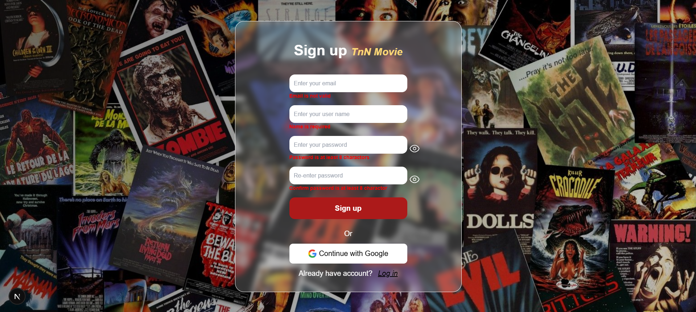

# Muvia - Website Xem Phim Online

**Muvia** là một nền tảng xem phim trực tuyến, cung cấp một thư viện phong phú các bộ phim, từ các bộ phim mới nhất, phim bom tấn, cho đến các thể loại đa dạng như hành động, khoa học viễn tưởng, tình cảm, và nhiều thể loại khác. Với giao diện thân thiện và dễ sử dụng, Muvia giúp người dùng dễ dàng tìm kiếm và thưởng thức những bộ phim yêu thích.

## Đăng ký

## Đăng nhập

## Trang chủ

## Lọc phim

## Chi tiết

## Xem phim

## Yêu thích

## Xem gần đây

## Tính Năng Chính

- **Tra cứu phim:** Chúng tôi cung cấp hơn 2000 bộ phim ở nhiều thể loại khác nhau, từ phim chiếu rạp đến phim truyền hình,....
- **Lọc nâng cao:** Người dùng có thể tìm kiếm theo tên phim, thể loại, quốc gia sản xuất, năm phát hành, và các yếu tố khác.
- **Tìm kiếm theo tên:** Người dùng có thể tìm kiếm phim theo tên cụ thể.
- **Quản lý phim yêu thích:** Người dùng có thể thích hoặc bỏ thích phim, quản lý trong trang cá nhân.
- **Quản lý phim đã xem:** Khi người dùng xem phim, hệ thống tự động ghi nhận lại tập phim, bộ phim, thời gian coi hiện tại, người dùng có thể xóa lịch sử trong trang cá nhân.

## Công Nghệ Sử Dụng

- **Muvia** được phát triển dựa theo kiến trúc Microservice monorepo, phát triển Graphql API cung cấp dữ liệu cho phía Front-end sử dụng Apollo và Apollo Federation.
- **Frontend:** ReactJs, NextJs, Tailwind CSS, HeroUI, Redux-Toolkit, Apollo Client
- **Backend:** NodeJs, NestJs, Apollo Gateway, Apollo Federation, Prisma ORM
- **Database:** MongoDB

## Liên Hệ

- Email: phamhuutuan24112003@gmail.com
- Phone: 0928895717

## Giấy Phép

Muvia chỉ phục vụ mục đích học tập và nghiên cứu, không thực hiện thương mại với các nội dung phim bên trong trang web. 
