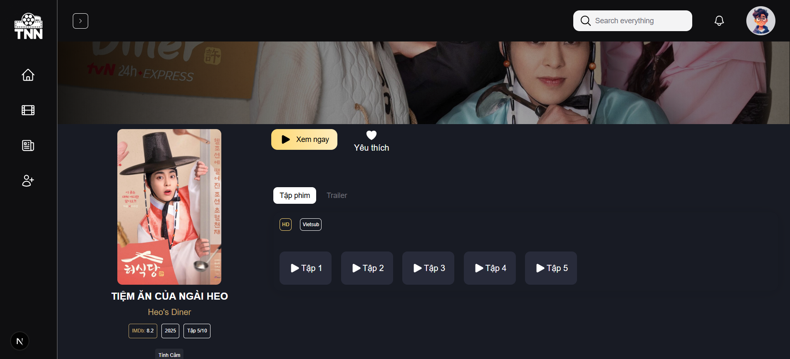

# Muvia - Website Xem Phim Online

**Muvia** là một nền tảng xem phim trực tuyến, cung cấp một thư viện phong phú các bộ phim, từ các bộ phim mới nhất, phim bom tấn, cho đến các thể loại đa dạng như hành động, khoa học viễn tưởng, tình cảm, và nhiều thể loại khác. Với giao diện thân thiện và dễ sử dụng, Muvia giúp người dùng dễ dàng tìm kiếm và thưởng thức những bộ phim yêu thích.

## Trang chủ

## Lọc phim

## Chi tiết

## Xem phim

## Tính Năng Chính

- **Thư viện phong phú:** Chúng tôi cung cấp hàng nghìn bộ phim ở nhiều thể loại khác nhau, từ phim chiếu rạp đến phim truyền hình.
- **Tìm kiếm nâng cao:** Người dùng có thể tìm kiếm theo tên phim, thể loại, quốc gia sản xuất, năm phát hành, và các yếu tố khác.
- **Phân loại phim:** Các bộ phim được phân loại theo thể loại như hành động, tình cảm, kinh dị, hoạt hình, v.v.
- **Xem phim trực tuyến:** Xem phim chất lượng cao mà không cần phải tải về, với tùy chọn các định dạng chất lượng từ SD đến HD.
- **Cập nhật phim mới:** Website tự động cập nhật các bộ phim mới nhất để người dùng không bao giờ bỏ lỡ các bộ phim đang hot.

## Công Nghệ Sử Dụng

- **Muvia** được phát triển dựa theo kiến trúc microservice monorepo, phát triển Graphql API cung cấp dữ liệu cho phía Front-end sử dụng Apollo và Apollo Federation .
- **Frontend:** React, NextJs, Tailwind CSS, HeroUI
- **Backend:** Node.js, NestJs, Apollo, Prisma ORM
- **Database:** MongoDB

## Liên Hệ

- Email: phamhuutuan24112003@gmail.com
- GitHub: [github.com/username](https://github.com/username)

## Giấy Phép

Muvia chỉ phục vụ mục đích học tập và nghiên cứu, không thực hiện thương mại với các nội dung phim bên trong trang web. 
